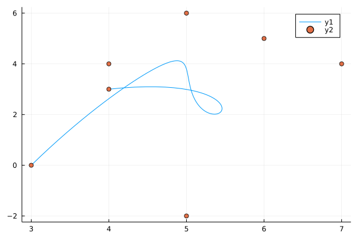

# Bezier.jl
a minimal implementation of nth-degree-Bezier curves in julia

## Implementation
This module generates Bezier curves of arbitrary degree (in theory).
The nth-Degree bezier curve is generated with Bernstein-Polynomials.
Since julia has a efficient binomial function, this generation,
The maximum number of control points is 67. For larger numbers,
a buffer overflow occurs in the binomial function.

The degree of the Bezier curve is inferred from the number of control points.

The idea was taken from ["A Primer on Bézier Curves"](https://pomax.github.io/bezierinfo/).


### Examples

Return two lists with the x and y values for the quadratic bezier curve that
spans from (0,0) to (1,1) with the controll point (0,1);

```julia
  bezier([0,1,0],[0,1,1])
```

Return a cubic bezier curve with an added controll point at (0,1):

```julia
  bezier([0,0,0,1],[0,1,1,1])
```

#### Plotting
The number of coordinates is 100 by default, but can be modified with the range keyword.

```julia
  using Plots, Bezier

  plot(bezier([0,0.5,1],[0,1.8,0]))
  plot!(bezier([0,0,1,1],[0,1,-1,0.5]))
  plot!(bezier([0,0,1,1],[0,1,-1,0.5], 0:0.2:1))
```


```julia
  using Plots, Bezier

  m = [4 7 5 4 6 5 3; 3 4 -2 4 5 6 0]
  plot(bezier(m))
  scatter!(m[1,:],m[2,:])
```

